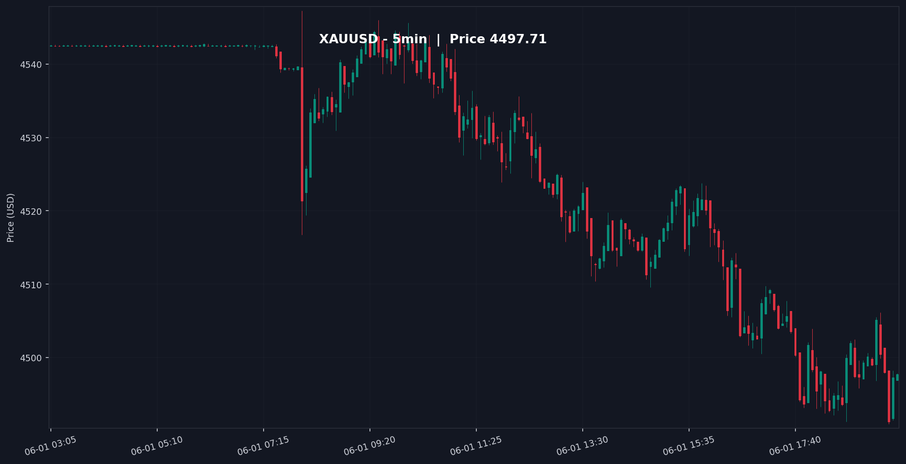

<div align="center">

# 🤖 XAUUSD Quarterly-Theory Engine

### _trade **with** the algorithm, not against it._

**A deterministic Smart-Money trading engine for Gold (XAUUSD): a tested Python core computes Quarterly-Theory signals, an AI vision pass narrates the market, and signals route to Telegram, a live dashboard, and — only when you explicitly arm it — MetaTrader 5.**

<br/>


</div>

---

## 📑 Table of Contents

- [💡 Overview](#-overview)
- [🚧 What actually runs today](#-what-actually-runs-today)
- [⚙️ How it works](#️-how-it-works)
- [🧮 The deterministic engine](#-the-deterministic-engine)
- [📟 Output example](#-output-example)
- [🖥️ Dashboards & API](#️-dashboards--api)
- [🧰 Tech stack](#-tech-stack)
- [🚀 Installation & usage](#-installation--usage)
- [🔧 Configuration](#-configuration)
- [🛡️ Safety — real money](#️-safety--real-money)
- [🧪 Tests](#-tests)
- [⚠️ Disclaimer](#️-disclaimer)
- [📄 License](#-license)

---

## 💡 Overview

> **Most retail traders draw lines on a chart. Smart money draws liquidity.**

This engine fuses a **deterministic algorithmic core** with an **AI vision narrative**, and
keeps the two strictly separate:

- 🧮 **The engine decides.** Pure, unit-tested Python modules compute the True Day anchor, the
  90-minute cycle and its four 22.5-minute quarters, HTF bias against True Monthly / Weekly /
  Daily Opens, liquidity sweeps, market-structure shifts, FVG/IFVG, the OTE zone, volume
  profile, position size, and the stop. Nothing about the entry decision is delegated to a model.
- 👁️ **The AI narrates.** A Claude vision pass reads a rendered TradingView-style chart against
  your own Smart-Money notes and produces a daily written report. It is commentary, not the
  trigger.
- 📨 **Delivery.** Signals and the report go to **Telegram** with a chart snapshot, to a live
  **web dashboard**, and — behind an explicit gate — to **MetaTrader 5** as real orders.

📈 **The philosophy:** stop guessing tops and bottoms. Trade **time and price** alongside the
algorithm, and make every step of that reasoning testable.

---

## 🚧 What actually runs today

Being exact about the state matters more than a feature list:

| Area | Status |
|---|---|
| Quarterly-Theory engine (quarters, bias, SMC, volume profile, risk, strategy) | ✅ implemented, 143 unit tests |
| Daily AI vision report → Telegram (08:00 Asia/Jerusalem) | ✅ implemented |
| Intraday strategy poll → signal → Telegram + dashboard | ✅ implemented |
| aiohttp monitoring dashboard (token-gated) | ✅ implemented, off unless `DASHBOARD_TOKEN` is set |
| FastAPI backend (`:8000`) + Next.js console (`:3005`) | ✅ implemented |
| Observability stack (JSON logs → Vector → Loki; StatsD → Prometheus → Grafana; Uptime Kuma) | ✅ implemented in `docker-compose.yml` |
| MT5 order placement | ✅ implemented, **gated off by default** (`LIVE_TRADING=false`) |
| MT5 as a live data feed / execution venue | ⚠️ Windows only — elsewhere the bot falls back to TwelveData |
| DXY inverse-correlation check during manipulation | 🔜 designed, no DXY feed wired yet |
| Volume profile on the fallback feed | ⚠️ skipped — TwelveData `XAU/USD` carries no real volume, so POC/VAH/VAL are unavailable that cycle |

---

## ⚙️ How it works

Two schedules run in one asyncio process:

| Schedule | Cadence | What happens |
|:--|:--|:--|
| **Daily AI report** | 08:00 Asia/Jerusalem (plus once at startup) | pull candles → compute Quarterly levels → render chart PNG → Claude vision reads it against your `Research/` notes → formatted report + chart to Telegram |
| **Strategy poll** | every `STRATEGY_POLL_MIN` minutes | session gate → quarter/bias/SMC evaluation → at most one action per 90-minute cycle → size + stop → Telegram, dashboard, and (if armed) an MT5 order |

| Step | Stage | What happens |
|:----:|:------|:-------------|
| 1️⃣ | **Data ingestion** | OHLCV from **MetaTrader 5** (primary, Windows) with automatic fallback to **TwelveData** (Docker/Linux). |
| 2️⃣ | **Quarterly levels** | `logic.py` computes the institutional anchors — **TYO, TMO, TWO, TDO**. |
| 3️⃣ | **Engine evaluation** | `strategy.evaluate_setup` runs the full decision chain (below) and returns a `Signal` or nothing. |
| 4️⃣ | **Risk sizing** | `risk.py` sizes the position (XAUUSD 100 oz/lot), places the stop outside the Judas range, and enforces RRR ≥ 3. |
| 5️⃣ | **Chart + AI narrative** | `chart_generator.py` renders a 5-minute dark TradingView-style PNG; Claude reads it for the daily report. |
| 6️⃣ | **Delivery** | Telegram alert + chart · live dashboard state · MT5 order **only if `LIVE_TRADING=true`**. |

---

## 🧮 The deterministic engine

Pure, I/O-free modules — each with its own test file under `tests/`:

| Module | Responsibility |
|---|---|
| `quarters.py` | True Day anchor (18:00 NY) → 90-min cycle → four 22.5-min micro-quarters Q1–Q4 |
| `smc.py` | FVG, IFVG, swing highs/lows, liquidity sweeps, MSS, OTE 0.62–0.79 fib zone |
| `volume_profile.py` | POC / VAH / VAL, Anchored VWAP |
| `bias.py` | HTF bias vs TMO/TWO/TDO → bullish / bearish / neutral + `synchronized` |
| `risk.py` | position sizing, SL outside the Judas range, RRR ≥ 3 gate, scale-out levels |
| `strategy.py` | the entry decision chain; produces a `Signal` |
| `orchestration.py` | session gate, per-cycle dedupe (`CycleGuard`), Telegram message format |
| `research.py` | loads `Research/*.md` and `*.txt` notes into the AI prompt |
| `appstate.py` | in-memory live state for the dashboards (`AppState`, singleton `STATE`) |
| `execution.py` | MT5 order placement behind the `LIVE_TRADING` gate; `MT5Broker` wrapper |
| `webserver.py` | aiohttp dashboard (token-gated `/api/state` and `/chart.png`) |
| `api.py` | FastAPI backend for the Next.js console; reads live state, writes runtime config |
| `botconfig.py` · `jsonlog.py` · `metrics.py` · `mt5session.py` | runtime config store · JSON logging · StatsD metrics · MT5 session handling |

I/O and orchestration live in `main.py` (entry point, schedulers, wiring), `logic.py` (feed
switch, Quarterly levels, account balance) and `chart_generator.py`.

**The decision chain, in the engine's own terms:**

```text
IF (Current_Time == Q3_Window) AND (HTF_Bias == Synchronized):
    IF (Q2_Judas_Swing == Completed) AND (Liquidity_Sweep == True):
        IF (Price_Action == MSS) AND (Retest == IFVG_or_OTE):
            EXECUTE ENTRY
```

Trading is forbidden during Q1 accumulation; the stop always sits outside the Q2 manipulation
range; targets are opposing liquidity, POC/value-area boundaries, or a fixed 1:3+ RRR.

---

## 📟 Output example

> The **strategy poll** posts a deterministic signal built by `orchestration.format_signal_message`.
> Every message carries the current mode, so a dry run can never be mistaken for a live one 👇

```text
🔴 XAUUSD SHORT  [DRY-RUN]
━━━━━━━━━━━━━━━━━━━━
🕒 Quarter: Q3  |  Bias: bearish

Entry : 2419.80
SL    : 2424.60
TP1   : 2410.20
TP2   : 2402.30
R:R   : 1:3.6
Lots  : 0.42

🎲 Confidence: 8/10
🧭 Q2 sweep of buy-side liquidity, MSS down, retest into the IFVG
```

When the engine finds no valid setup it says so explicitly rather than going quiet:

```text
⚪️ XAUUSD Quarterly-Theory  [DRY-RUN]
━━━━━━━━━━━━━━━━━━━━
🎯 NO TRADE  (quarter Q1)
💬 Q1 accumulation — trading forbidden this quarter
💰 Price: 2417.35
```

The separate **daily 08:00 report** is free-form prose written by the Claude vision pass over
the rendered chart and your `Research/` notes, delivered with the chart image attached.

The chart the AI reads (and the dashboard serves) looks like this:

<div align="center">



_Live 5-minute XAUUSD chart auto-generated by the engine (dark TradingView theme)._

</div>

---

## 🖥️ Dashboards & API

Three surfaces read the same live `AppState`:

| Surface | Where | Notes |
|---|---|---|
| **aiohttp dashboard** | `:8080` | Four sections: status + mode · levels/bias/POC · last signal · chart + log. The page shell at `/` is public; `/api/state` and `/chart.png` are **token-gated** (constant-time compare, `?token=…` or `X-Token`). Disabled entirely unless `DASHBOARD_TOKEN` is set. Polls every `DASHBOARD_REFRESH_SEC`. |
| **FastAPI backend** | `:8000` | Runs inside the bot's event loop, so it reads live state and `/api/config` writes mutate the running bot. CORS allows the Next.js origin on `:3005`. |
| **Next.js console** | `web/` (`:3005`) | Full dashboard UI against the FastAPI backend. A separate Vite console lives in `frontend/` and is served on `:8081` by compose. |

`/health` is public so an uptime probe can reach it without a token.

---

## 🧰 Tech stack

| Component | Technology |
|:----------|:-----------|
| 🐍 **Language / runtime** | Python **3.11** (asyncio) |
| 🧠 **AI narrative** | Anthropic **Claude** (vision) |
| 📡 **Market data** | **MetaTrader 5** → **TwelveData** fallback |
| 📊 **Charting** | `mplfinance` (TradingView dark theme) |
| 📨 **Delivery** | `python-telegram-bot` |
| ⏰ **Scheduler** | `APScheduler` (daily cron + interval poll) |
| 🌐 **Web** | `aiohttp` dashboard · **FastAPI** + `uvicorn` · **Next.js 14** console · **Vite/React** console |
| 📈 **Observability** | JSON logs → **Vector** → **Loki** · StatsD → **statsd_exporter** → **Prometheus** → **Grafana** · **Uptime Kuma** |
| 🧪 **Tests** | `pytest` — 143 passing |
| 🐳 **Deployment** | Docker / Docker Compose |

---

## 🚀 Installation & usage

### 1️⃣ Clone the repository

```bash
git clone https://github.com/www8351/Gold_BOT_Alaret.git
cd Gold_BOT_Alaret
```

### 2️⃣ Install dependencies

```bash
pip install -r requirements.txt
```

> 💡 `MetaTrader5` is declared with a PEP 508 marker and installs on **Windows** only. On
> Linux/macOS/Docker the engine auto-routes to the **TwelveData** fallback.

### 3️⃣ Create your `.env`

Copy [`.env.example`](.env.example) — it documents every variable, grouped by concern — and
fill in at least `TELEGRAM_TOKEN`, `CHAT_ID`, `ANTHROPIC_API_KEY`, and `TWELVEDATA_API_KEY`.

### 4️⃣ Run it

**Local (Python):**

```bash
python main.py            # bot + dashboard + FastAPI in one process
python run_api.py         # FastAPI only (host API runner)
```

**Docker (recommended for 24/7):**

```bash
docker compose up -d
```

Compose brings up the bot alongside the full observability stack:
bot `:8080` · FastAPI `:8000` · Vite console `:8081` · Grafana `:3000` ·
Uptime Kuma `:3001` · Prometheus `:9090` · Loki `:3100`.

> 🗂️ Drop your personal Smart-Money strategy notes and screenshots into a **`Research/`**
> folder at the repo root (mounted read-only into the container); the engine feeds them to the
> AI as ground-truth context. The folder is not tracked in git — it holds your own material.

---

## 🔧 Configuration

Full template in [`.env.example`](.env.example). The variables that matter most:

| Variable | Required | Default | Description |
|:---------|:--------:|:-------:|:------------|
| `TELEGRAM_TOKEN` | ✅ | — | Telegram Bot API token |
| `CHAT_ID` | ✅ | — | Destination chat / channel ID |
| `ANTHROPIC_API_KEY` | ✅ | — | Claude API key (vision report) |
| `TWELVEDATA_API_KEY` | ✅ | — | TwelveData key (fallback feed) |
| `MT5_LOGIN` / `MT5_PASSWORD` / `MT5_SERVER` / `MT5_SYMBOL` | ⬜ | — | MetaTrader 5 feed + live execution (Windows) |
| `RISK_PCT` | ⬜ | `0.01` | fraction of balance risked per trade |
| `SL_BUFFER` | ⬜ | `0.5` | extra price beyond the Judas range for the stop |
| `STRATEGY_POLL_MIN` | ⬜ | `5` | strategy evaluation cadence, in minutes |
| `ACCOUNT_BALANCE` | ⬜ | `10000` | sizing fallback when the MT5 balance is unavailable |
| `SESSION_START_HOUR` / `SESSION_END_HOUR` | ⬜ | `2` / `16` | NY-hour trading window (London + NY) |
| `QT_TRUE_DAY_OPEN_HOUR` | ⬜ | `18` | True Day open hour, NY time |
| `DASHBOARD_TOKEN` | ⬜ | — | **required to enable** the dashboard |
| `DASHBOARD_HOST` / `DASHBOARD_PORT` / `DASHBOARD_REFRESH_SEC` | ⬜ | `0.0.0.0` / `8080` / `5` | dashboard bind + browser poll interval |
| `API_HOST` / `API_PORT` | ⬜ | `127.0.0.1` / `8000` | FastAPI backend bind |
| `METRICS_ENABLED` / `STATSD_HOST` / `STATSD_PORT` | ⬜ | `true` / `127.0.0.1` / `9125` | StatsD metrics egress |
| `LIVE_TRADING` | ⬜ | `false` | **see Safety below** |
| `TZ` / `LOG_LEVEL` | ⬜ | `Asia/Jerusalem` / `INFO` | timezone · logging verbosity |

---

## 🛡️ Safety — real money

`LIVE_TRADING` defaults to **false**, which is a dry run: the bot computes, sizes, and posts
signals to Telegram and the dashboard but places **no MT5 orders**. Set it to `true` only after
you have watched dry-run signals long enough to trust them.

- `execution.place_order` is the **single gate** for order placement — never bypass it.
- Dashboard data routes must stay token-gated whenever the server is bound to `0.0.0.0`.
- `.env` holds live secrets and is gitignored — never commit it.

---

## 🧪 Tests

```bash
python -m pytest          # 143 tests
```

Every pure module has a matching `tests/test_*.py`, including the webserver and API routes.
The convention in this repo is test-first: write the failing test, then the minimal code.
`main.py` and `logic.py` hold the side effects and are exercised by running the bot rather
than by unit tests.

---

## ⚠️ Disclaimer

> **This software is for educational and research purposes only. It is _not_ financial advice.**
> Trading leveraged instruments carries substantial risk of loss. Automated signals can be
> wrong. You are solely responsible for your own decisions and capital. Never trade money you
> cannot afford to lose.

---

## 📄 License

Released under the **MIT License**. See [`LICENSE`](LICENSE) for details.

<div align="center">

<br/>

**⭐ If this engine sharpens your edge, drop a star.**

_Built for traders who follow the algorithm._ 🤖📈

</div>
